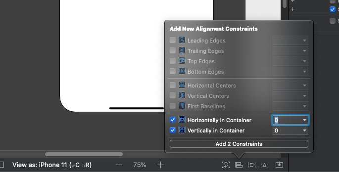

<!-- markdownlint-disable MD002 MD041 -->

<span data-ttu-id="86707-101">Erstellen Sie zunächst ein neues SWIFT-Projekt.</span><span class="sxs-lookup"><span data-stu-id="86707-101">Begin by creating a new Swift project.</span></span>

1. <span data-ttu-id="86707-102">Öffnen Sie Xcode.</span><span class="sxs-lookup"><span data-stu-id="86707-102">Open Xcode.</span></span> <span data-ttu-id="86707-103">Wählen Sie im Menü **Datei** die Option **neu**und dann **Projekt**aus.</span><span class="sxs-lookup"><span data-stu-id="86707-103">On the **File** menu, select **New**, then **Project**.</span></span>
1. <span data-ttu-id="86707-104">Wählen Sie die Vorlage **einzelne Ansicht-App** aus, und wählen Sie **weiter**aus.</span><span class="sxs-lookup"><span data-stu-id="86707-104">Choose the **Single View App** template and select **Next**.</span></span>

    

1. <span data-ttu-id="86707-106">Legen Sie den **Produktnamen** auf `GraphTutorial` und die **Sprache** in **SWIFT**fest.</span><span class="sxs-lookup"><span data-stu-id="86707-106">Set the **Product Name** to `GraphTutorial` and the **Language** to **Swift**.</span></span>
1. <span data-ttu-id="86707-107">Füllen Sie die restlichen Felder aus, und wählen Sie **weiter**aus.</span><span class="sxs-lookup"><span data-stu-id="86707-107">Fill in the remaining fields and select **Next**.</span></span>
1. <span data-ttu-id="86707-108">Wählen Sie einen Speicherort für das Projekt aus, und wählen Sie **Erstellen**aus.</span><span class="sxs-lookup"><span data-stu-id="86707-108">Choose a location for the project and select **Create**.</span></span>

## <a name="install-dependencies"></a><span data-ttu-id="86707-109">Installieren von Abhängigkeiten</span><span class="sxs-lookup"><span data-stu-id="86707-109">Install dependencies</span></span>

<span data-ttu-id="86707-110">Installieren Sie vor dem Verschieben einige zusätzliche Abhängigkeiten, die Sie später verwenden werden.</span><span class="sxs-lookup"><span data-stu-id="86707-110">Before moving on, install some additional dependencies that you will use later.</span></span>

- <span data-ttu-id="86707-111">[Microsoft Authentication Library (MSAL) für IOS](https://github.com/AzureAD/microsoft-authentication-library-for-objc) zur Authentifizierung mit Azure AD.</span><span class="sxs-lookup"><span data-stu-id="86707-111">[Microsoft Authentication Library (MSAL) for iOS](https://github.com/AzureAD/microsoft-authentication-library-for-objc) for authenticating to with Azure AD.</span></span>
- <span data-ttu-id="86707-112">[Microsoft Graph-SDK für Objective C](https://github.com/microsoftgraph/msgraph-sdk-objc) zum tätigen von Anrufen an Microsoft Graph.</span><span class="sxs-lookup"><span data-stu-id="86707-112">[Microsoft Graph SDK for Objective C](https://github.com/microsoftgraph/msgraph-sdk-objc) for making calls to Microsoft Graph.</span></span>
- <span data-ttu-id="86707-113">[Microsoft Graph-Modell SDK für Objective C](https://github.com/microsoftgraph/msgraph-sdk-objc-models) für stark typisierte Objekte, die Microsoft Graph-Ressourcen wie Benutzer oder Ereignisse darstellen.</span><span class="sxs-lookup"><span data-stu-id="86707-113">[Microsoft Graph Models SDK for Objective C](https://github.com/microsoftgraph/msgraph-sdk-objc-models) for strongly-typed objects representing Microsoft Graph resources like users or events.</span></span>

1. <span data-ttu-id="86707-114">Beenden Sie Xcode.</span><span class="sxs-lookup"><span data-stu-id="86707-114">Quit Xcode.</span></span>
1. <span data-ttu-id="86707-115">Öffnen Sie Terminal, und ändern Sie das Verzeichnis in den Speicherort Ihres **GraphTutorial** -Projekts.</span><span class="sxs-lookup"><span data-stu-id="86707-115">Open Terminal and change the directory to the location of your **GraphTutorial** project.</span></span>
1. <span data-ttu-id="86707-116">Führen Sie den folgenden Befehl aus, um eine Podfile zu erstellen.</span><span class="sxs-lookup"><span data-stu-id="86707-116">Run the following command to create a Podfile.</span></span>

    ```Shell
    pod init
    ```

1. <span data-ttu-id="86707-117">Öffnen Sie die Podfile, und fügen Sie die folgenden Zeilen `use_frameworks!` unmittelbar nach der Zeile hinzu.</span><span class="sxs-lookup"><span data-stu-id="86707-117">Open the Podfile and add the following lines just after the `use_frameworks!` line.</span></span>

    ```Ruby
    pod 'MSAL', '~> 1.1.1'
    pod 'MSGraphClientSDK', ' ~> 1.0.0'
    pod 'MSGraphClientModels', '~> 1.3.0'
    ```

1. <span data-ttu-id="86707-118">Speichern Sie die Podfile, und führen Sie dann den folgenden Befehl aus, um die Abhängigkeiten zu installieren.</span><span class="sxs-lookup"><span data-stu-id="86707-118">Save the Podfile, then run the following command to install the dependencies.</span></span>

    ```Shell
    pod install
    ```

1. <span data-ttu-id="86707-119">Nachdem der Befehl abgeschlossen ist, öffnen Sie das neu erstellte **GraphTutorial. xcworkspace.** in Xcode.</span><span class="sxs-lookup"><span data-stu-id="86707-119">Once the command completes, open the newly created **GraphTutorial.xcworkspace** in Xcode.</span></span>

## <a name="design-the-app"></a><span data-ttu-id="86707-120">Entwerfen der App</span><span class="sxs-lookup"><span data-stu-id="86707-120">Design the app</span></span>

<span data-ttu-id="86707-121">In diesem Abschnitt werden die Ansichten für die App erstellt: eine Anmeldeseite, ein Registerkartenleisten-Navigator, eine Willkommensseite und eine Kalender Seite.</span><span class="sxs-lookup"><span data-stu-id="86707-121">In this section you will create the views for the app: a sign in page, a tab bar navigator, a welcome page, and a calendar page.</span></span> <span data-ttu-id="86707-122">Außerdem erstellen Sie ein Aktivitäts Indikator-Overlay.</span><span class="sxs-lookup"><span data-stu-id="86707-122">You'll also create an activity indicator overlay.</span></span>

### <a name="create-sign-in-page"></a><span data-ttu-id="86707-123">Anmeldeseite erstellen</span><span class="sxs-lookup"><span data-stu-id="86707-123">Create sign in page</span></span>

1. <span data-ttu-id="86707-124">Erweitern Sie den Ordner **GraphTutorial** in Xcode, und wählen Sie dann **ViewController. Swift**aus.</span><span class="sxs-lookup"><span data-stu-id="86707-124">Expand the **GraphTutorial** folder in Xcode, then select **ViewController.swift**.</span></span>
1. <span data-ttu-id="86707-125">Ändern Sie `SignInViewController.swift`im **Datei Inspektor**den **Namen** der Datei in.</span><span class="sxs-lookup"><span data-stu-id="86707-125">In the **File Inspector**, change the **Name** of the file to `SignInViewController.swift`.</span></span>

    

1. <span data-ttu-id="86707-127">Öffnen Sie **SignInViewController. Swift** , und ersetzen Sie den Inhalt durch den folgenden Code.</span><span class="sxs-lookup"><span data-stu-id="86707-127">Open **SignInViewController.swift** and replace its contents with the following code.</span></span>

    ```Swift
    import UIKit

    class SignInViewController: UIViewController {

        override func viewDidLoad() {
            super.viewDidLoad()
            // Do any additional setup after loading the view.
        }

        @IBAction func signIn() {
            self.performSegue(withIdentifier: "userSignedIn", sender: nil)
        }
    }
    ```

1. <span data-ttu-id="86707-128">Öffnen Sie die Datei **Main. Storyboard** .</span><span class="sxs-lookup"><span data-stu-id="86707-128">Open the **Main.storyboard** file.</span></span>
1. <span data-ttu-id="86707-129">Erweitern Sie **View Controller Scene**, und wählen Sie dann **View Controller**aus.</span><span class="sxs-lookup"><span data-stu-id="86707-129">Expand **View Controller Scene**, then select **View Controller**.</span></span>

    

1. <span data-ttu-id="86707-131">Wählen Sie den **Identitäts Inspektor**aus, und ändern Sie dann das Dropdownmenü **Klasse** in **SignInViewController**.</span><span class="sxs-lookup"><span data-stu-id="86707-131">Select the **Identity Inspector**, then change the **Class** dropdown to **SignInViewController**.</span></span>

    

1. <span data-ttu-id="86707-133">Wählen Sie die **Bibliothek**aus, und ziehen Sie dann eine **Schaltfläche** auf den **Anmelde Ansichts Controller**.</span><span class="sxs-lookup"><span data-stu-id="86707-133">Select the **Library**, then drag a **Button** onto the **Sign In View Controller**.</span></span>

    

1. <span data-ttu-id="86707-135">Wählen Sie mit ausgewählter Schaltfläche den **Attributes Inspector** aus, und ändern Sie den `Sign In` **Titel** der Schaltfläche in.</span><span class="sxs-lookup"><span data-stu-id="86707-135">With the button selected, select the **Attributes Inspector** and change the **Title** of the button to `Sign In`.</span></span>

    

1. <span data-ttu-id="86707-137">Klicken Sie auf die Schaltfläche ausgewählt, und wählen Sie am unteren Rand des Storyboards die Schaltfläche **Ausrichten** aus.</span><span class="sxs-lookup"><span data-stu-id="86707-137">With the button selected, select the **Align** button at the bottom of the storyboard.</span></span> <span data-ttu-id="86707-138">Wählen Sie sowohl **horizontal im Container** als auch **vertikal im Container** Constraints, lassen Sie Ihre Werte als 0, und wählen Sie dann **2 Abhängigkeiten hinzufügen**aus.</span><span class="sxs-lookup"><span data-stu-id="86707-138">Select both the **Horizontally in container** and **Vertically in container** constraints, leave their values as 0, then select **Add 2 constraints**.</span></span>

    

1. <span data-ttu-id="86707-140">Wählen Sie den **Controller anmelden**aus, und wählen Sie dann den **Verbindungs Inspektor**aus.</span><span class="sxs-lookup"><span data-stu-id="86707-140">Select the **Sign In View Controller**, then select the **Connections Inspector**.</span></span>
1. <span data-ttu-id="86707-141">Ziehen Sie unter **empfangene Aktionen**den ungefüllten Kreis neben **SignIn** auf die Schaltfläche.</span><span class="sxs-lookup"><span data-stu-id="86707-141">Under **Received Actions**, drag the unfilled circle next to **signIn** onto the button.</span></span> <span data-ttu-id="86707-142">Wählen Sie im Popup Menü die Option nach **oben innen berühren** aus.</span><span class="sxs-lookup"><span data-stu-id="86707-142">Select **Touch Up Inside** on the pop-up menu.</span></span>

    

### <a name="create-tab-bar"></a><span data-ttu-id="86707-144">Registerkartenleiste erstellen</span><span class="sxs-lookup"><span data-stu-id="86707-144">Create tab bar</span></span>

1. <span data-ttu-id="86707-145">Wählen Sie die **Bibliothek**aus, und ziehen Sie dann einen **Registerkartenleisten-Controller** auf das Storyboard.</span><span class="sxs-lookup"><span data-stu-id="86707-145">Select the **Library**, then drag a **Tab Bar Controller** onto the storyboard.</span></span>
1. <span data-ttu-id="86707-146">Wählen Sie den **Controller anmelden**aus, und wählen Sie dann den **Verbindungs Inspektor**aus.</span><span class="sxs-lookup"><span data-stu-id="86707-146">Select the **Sign In View Controller**, then select the **Connections Inspector**.</span></span>
1. <span data-ttu-id="86707-147">Ziehen Sie unter **ausgelöste Segues**den ungefüllten Kreis neben **manuell** auf den **Registerkartenleisten-Controller** auf dem Storyboard.</span><span class="sxs-lookup"><span data-stu-id="86707-147">Under **Triggered Segues**, drag the unfilled circle next to **manual** onto the **Tab Bar Controller** on the storyboard.</span></span> <span data-ttu-id="86707-148">Wählen Sie im Popup Menü **Modal** aus.</span><span class="sxs-lookup"><span data-stu-id="86707-148">Select **Present Modally** in the pop-up menu.</span></span>

    

1. <span data-ttu-id="86707-150">Wählen Sie das soeben hinzugefügte segue aus, und wählen Sie dann den **Attributes Inspector**aus.</span><span class="sxs-lookup"><span data-stu-id="86707-150">Select the segue you just added, then select the **Attributes Inspector**.</span></span> <span data-ttu-id="86707-151">Legen Sie **Identifier** das Feldbezeichner `userSignedIn`auf fest, und legen Sie die **Präsentation** auf **Vollbildmodus**fest.</span><span class="sxs-lookup"><span data-stu-id="86707-151">Set the **Identifier** field to `userSignedIn`, and set **Presentation** to **Full Screen**.</span></span>

    

1. <span data-ttu-id="86707-153">Wählen Sie die **Szene Element 1**aus, und wählen Sie dann den **Verbindungs Inspektor**aus.</span><span class="sxs-lookup"><span data-stu-id="86707-153">Select the **Item 1 Scene**, then select the **Connections Inspector**.</span></span>
1. <span data-ttu-id="86707-154">Ziehen Sie unter **ausgelöste Segues**den ungefüllten Kreis neben **manuell** auf den **Anmelde Ansichts Controller** auf dem Storyboard.</span><span class="sxs-lookup"><span data-stu-id="86707-154">Under **Triggered Segues**, drag the unfilled circle next to **manual** onto the **Sign In View Controller** on the storyboard.</span></span> <span data-ttu-id="86707-155">Wählen Sie im Popup Menü **Modal** aus.</span><span class="sxs-lookup"><span data-stu-id="86707-155">Select **Present Modally** in the pop-up menu.</span></span>
1. <span data-ttu-id="86707-156">Wählen Sie das soeben hinzugefügte segue aus, und wählen Sie dann den **Attributes Inspector**aus.</span><span class="sxs-lookup"><span data-stu-id="86707-156">Select the segue you just added, then select the **Attributes Inspector**.</span></span> <span data-ttu-id="86707-157">Legen Sie **Identifier** das Feldbezeichner `userSignedOut`auf fest, und legen Sie die **Präsentation** auf **Vollbildmodus**fest.</span><span class="sxs-lookup"><span data-stu-id="86707-157">Set the **Identifier** field to `userSignedOut`, and set **Presentation** to **Full Screen**.</span></span>

### <a name="create-welcome-page"></a><span data-ttu-id="86707-158">Willkommensseite erstellen</span><span class="sxs-lookup"><span data-stu-id="86707-158">Create welcome page</span></span>

1. <span data-ttu-id="86707-159">Wählen Sie die Datei **Assets. xcassets** aus.</span><span class="sxs-lookup"><span data-stu-id="86707-159">Select the **Assets.xcassets** file.</span></span>
1. <span data-ttu-id="86707-160">Wählen Sie im Menü **Editor** die Option **Objekte hinzufügen**und dann **neuer Bildsatz**aus.</span><span class="sxs-lookup"><span data-stu-id="86707-160">On the **Editor** menu, select **Add Assets**, then **New Image Set**.</span></span>
1. <span data-ttu-id="86707-161">Wählen Sie das neue **Image** -Objekt aus, und verwenden Sie den **Attribut Inspektor** , um seinen **Namen** auf `DefaultUserPhoto`festzulegen.</span><span class="sxs-lookup"><span data-stu-id="86707-161">Select the new **Image** asset and use the **Attribute Inspector** to set its **Name** to `DefaultUserPhoto`.</span></span>
1. <span data-ttu-id="86707-162">Fügen Sie ein beliebiges Bild hinzu, das Sie als Standardbenutzer Profilfoto dienen möchten.</span><span class="sxs-lookup"><span data-stu-id="86707-162">Add any image you like to serve as a default user profile photo.</span></span>

    

1. <span data-ttu-id="86707-164">Erstellen Sie eine neue **Cocoa Touch-Klassen** Datei im **GraphTutorial** - `WelcomeViewController`Ordner mit dem Namen.</span><span class="sxs-lookup"><span data-stu-id="86707-164">Create a new **Cocoa Touch Class** file in the **GraphTutorial** folder named `WelcomeViewController`.</span></span> <span data-ttu-id="86707-165">Wählen Sie **ulviewcontroller** in der unter **Klasse von Field aus** .</span><span class="sxs-lookup"><span data-stu-id="86707-165">Choose **UIViewController** in the **Subclass of** field.</span></span>
1. <span data-ttu-id="86707-166">Öffnen Sie **WelcomeViewController. Swift** , und ersetzen Sie den Inhalt durch den folgenden Code.</span><span class="sxs-lookup"><span data-stu-id="86707-166">Open **WelcomeViewController.swift** and replace its contents with the following code.</span></span>

    ```Swift
    import UIKit

    class WelcomeViewController: UIViewController {

        @IBOutlet var userProfilePhoto: UIImageView!
        @IBOutlet var userDisplayName: UILabel!
        @IBOutlet var userEmail: UILabel!

        override func viewDidLoad() {
            super.viewDidLoad()

            // Do any additional setup after loading the view.

            // TEMPORARY
            self.userProfilePhoto.image = UIImage(imageLiteralResourceName: "DefaultUserPhoto")
            self.userDisplayName.text = "Default User"
            self.userEmail.text = "default@contoso.com"
        }

        @IBAction func signOut() {
            self.performSegue(withIdentifier: "userSignedOut", sender: nil)
        }
    }
    ```

1. <span data-ttu-id="86707-167">Öffnen Sie **Main. Storyboard**.</span><span class="sxs-lookup"><span data-stu-id="86707-167">Open **Main.storyboard**.</span></span> <span data-ttu-id="86707-168">Wählen Sie die **Szene Element 1**aus, und wählen Sie dann den **Identitäts Inspektor**aus.</span><span class="sxs-lookup"><span data-stu-id="86707-168">Select the **Item 1 Scene**, then select the **Identity Inspector**.</span></span> <span data-ttu-id="86707-169">Ändern Sie den Wert der **Klasse** in **WelcomeViewController**.</span><span class="sxs-lookup"><span data-stu-id="86707-169">Change the **Class** value to **WelcomeViewController**.</span></span>
1. <span data-ttu-id="86707-170">Fügen Sie mithilfe der **Bibliothek**die folgenden Elemente zur **Szene Element 1**hinzu.</span><span class="sxs-lookup"><span data-stu-id="86707-170">Using the **Library**, add the following items to the **Item 1 Scene**.</span></span>

    - <span data-ttu-id="86707-171">Eine **Bildansicht**</span><span class="sxs-lookup"><span data-stu-id="86707-171">One **Image View**</span></span>
    - <span data-ttu-id="86707-172">Zwei **Beschriftungen**</span><span class="sxs-lookup"><span data-stu-id="86707-172">Two **Labels**</span></span>
    - <span data-ttu-id="86707-173">Eine **Schaltfläche**</span><span class="sxs-lookup"><span data-stu-id="86707-173">One **Button**</span></span>
1. <span data-ttu-id="86707-174">Stellen Sie über den **Connections Inspector**folgende Verbindungen her.</span><span class="sxs-lookup"><span data-stu-id="86707-174">Using the **Connections Inspector**, make the following connections.</span></span>

    - <span data-ttu-id="86707-175">Verknüpfen Sie die **User** -Steckdose mit dem ersten Etikett.</span><span class="sxs-lookup"><span data-stu-id="86707-175">Link the **userDisplayName** outlet to the first label.</span></span>
    - <span data-ttu-id="86707-176">Verknüpfen Sie die **userEmail** -Steckdose mit der zweiten Bezeichnung.</span><span class="sxs-lookup"><span data-stu-id="86707-176">Link the **userEmail** outlet to the second label.</span></span>
    - <span data-ttu-id="86707-177">Verknüpfen Sie die **userProfilePhoto** -Steckdose mit der Bildansicht.</span><span class="sxs-lookup"><span data-stu-id="86707-177">Link the **userProfilePhoto** outlet to the image view.</span></span>
    - <span data-ttu-id="86707-178">Verknüpfen Sie die Aktion " **abgemeldete** empfangen" mit dem Touch der Schaltfläche nach **innen**.</span><span class="sxs-lookup"><span data-stu-id="86707-178">Link the **signOut** received action to the button's **Touch Up Inside**.</span></span>

1. <span data-ttu-id="86707-179">Wählen Sie die Ansicht Bild aus, und wählen Sie dann den **Größen Inspektor**aus.</span><span class="sxs-lookup"><span data-stu-id="86707-179">Select the image view, then select the **Size Inspector**.</span></span>
1. <span data-ttu-id="86707-180">Legen Sie die **Breite** und **Höhe** auf 196 fest.</span><span class="sxs-lookup"><span data-stu-id="86707-180">Set the **Width** and **Height** to 196.</span></span>
1. <span data-ttu-id="86707-181">Verwenden Sie die Schaltfläche **Ausrichten** , um die Constraint **horizontal in Container** mit dem Wert 0 hinzuzufügen.</span><span class="sxs-lookup"><span data-stu-id="86707-181">Use the **Align** button to add the **Horizontally in container** constraint with a value of 0.</span></span>
1. <span data-ttu-id="86707-182">Verwenden Sie die Schaltfläche **neue Einschränkungen hinzufügen** (neben der Schaltfläche **Ausrichten** ), um die folgenden Einschränkungen hinzuzufügen:</span><span class="sxs-lookup"><span data-stu-id="86707-182">Use the **Add New Constraints** button (next to the **Align** button) to add the following constraints:</span></span>

    - <span data-ttu-id="86707-183">Oben ausrichten an: sicherer Bereich, Wert: 0</span><span class="sxs-lookup"><span data-stu-id="86707-183">Align Top to: Safe Area, value: 0</span></span>
    - <span data-ttu-id="86707-184">Untere Fläche für: Benutzeranzeige Name, Wert: Standard</span><span class="sxs-lookup"><span data-stu-id="86707-184">Bottom Space to: User Display Name, value: Standard</span></span>
    - <span data-ttu-id="86707-185">Höhe, Wert: 196</span><span class="sxs-lookup"><span data-stu-id="86707-185">Height, value: 196</span></span>
    - <span data-ttu-id="86707-186">Breite, Wert: 196</span><span class="sxs-lookup"><span data-stu-id="86707-186">Width, value: 196</span></span>

    

1. <span data-ttu-id="86707-188">Wählen Sie die erste Bezeichnung aus, und verwenden Sie dann die Schaltfläche **Ausrichten** , um die Einschränkung **horizontal in Container** mit dem Wert 0 hinzuzufügen.</span><span class="sxs-lookup"><span data-stu-id="86707-188">Select the first label, then use the **Align** button to add the **Horizontally in container** constraint with a value of 0.</span></span>
1. <span data-ttu-id="86707-189">Verwenden Sie die Schaltfläche **neue Einschränkungen hinzufügen** , um die folgenden Einschränkungen hinzuzufügen:</span><span class="sxs-lookup"><span data-stu-id="86707-189">Use the **Add New Constraints** button to add the following constraints:</span></span>

    - <span data-ttu-id="86707-190">Oberer Bereich für: Benutzerprofil Foto, Wert: Standard</span><span class="sxs-lookup"><span data-stu-id="86707-190">Top Space to: User Profile Photo, value: Standard</span></span>
    - <span data-ttu-id="86707-191">Bottom Space to: Benutzer-e-Mail, Wert: Standard</span><span class="sxs-lookup"><span data-stu-id="86707-191">Bottom Space to: User Email, value: Standard</span></span>

1. <span data-ttu-id="86707-192">Wählen Sie die zweite Bezeichnung aus, und wählen Sie dann den **Attribut Inspektor**aus.</span><span class="sxs-lookup"><span data-stu-id="86707-192">Select the second label, then select the **Attributes Inspector**.</span></span>
1. <span data-ttu-id="86707-193">Ändern Sie die **Farbe** in **dunkelgrau**und ändern Sie die **Schriftart** in **System 12,0**.</span><span class="sxs-lookup"><span data-stu-id="86707-193">Change the **Color** to **Dark Gray Color**, and change the **Font** to **System 12.0**.</span></span>
1. <span data-ttu-id="86707-194">Verwenden Sie die Schaltfläche **Ausrichten** , um die Constraint **horizontal in Container** mit dem Wert 0 hinzuzufügen.</span><span class="sxs-lookup"><span data-stu-id="86707-194">Use the **Align** button to add the **Horizontally in container** constraint with a value of 0.</span></span>
1. <span data-ttu-id="86707-195">Verwenden Sie die Schaltfläche **neue Einschränkungen hinzufügen** , um die folgenden Einschränkungen hinzuzufügen:</span><span class="sxs-lookup"><span data-stu-id="86707-195">Use the **Add New Constraints** button to add the following constraints:</span></span>

    - <span data-ttu-id="86707-196">Oberer Speicherplatz für: Benutzeranzeige Name, Wert: Standard</span><span class="sxs-lookup"><span data-stu-id="86707-196">Top Space to: User Display Name, value: Standard</span></span>
    - <span data-ttu-id="86707-197">Bottom Space to: abmelden, Wert: 14</span><span class="sxs-lookup"><span data-stu-id="86707-197">Bottom Space to: Sign Out, value: 14</span></span>

1. <span data-ttu-id="86707-198">Wählen Sie die Schaltfläche aus, und wählen Sie dann den **Attribut Inspektor**aus.</span><span class="sxs-lookup"><span data-stu-id="86707-198">Select the button, then select the **Attributes Inspector**.</span></span>
1. <span data-ttu-id="86707-199">Ändern Sie **Title** den Titel `Sign Out`in.</span><span class="sxs-lookup"><span data-stu-id="86707-199">Change the **Title** to `Sign Out`.</span></span>
1. <span data-ttu-id="86707-200">Verwenden Sie die Schaltfläche **Ausrichten** , um die Constraint **horizontal in Container** mit dem Wert 0 hinzuzufügen.</span><span class="sxs-lookup"><span data-stu-id="86707-200">Use the **Align** button to add the **Horizontally in container** constraint with a value of 0.</span></span>
1. <span data-ttu-id="86707-201">Verwenden Sie die Schaltfläche **neue Einschränkungen hinzufügen** , um die folgenden Einschränkungen hinzuzufügen:</span><span class="sxs-lookup"><span data-stu-id="86707-201">Use the **Add New Constraints** button to add the following constraints:</span></span>

    - <span data-ttu-id="86707-202">Oberer Bereich für: Benutzer-e-Mail, Wert: 14</span><span class="sxs-lookup"><span data-stu-id="86707-202">Top Space to: User Email, value: 14</span></span>

1. <span data-ttu-id="86707-203">Wählen Sie das Element der Registerkartenleiste am unteren Rand der Szene aus, und wählen Sie dann den **Attributes Inspector**aus.</span><span class="sxs-lookup"><span data-stu-id="86707-203">Select the tab bar item at the bottom of the scene, then select the **Attributes Inspector**.</span></span> <span data-ttu-id="86707-204">Ändern Sie **Title** den Titel `Me`in.</span><span class="sxs-lookup"><span data-stu-id="86707-204">Change the **Title** to `Me`.</span></span>

<span data-ttu-id="86707-205">Die Begrüßungs Szene sollte wie folgt aussehen, wenn Sie fertig sind.</span><span class="sxs-lookup"><span data-stu-id="86707-205">The welcome scene should look similar to this once you're done.</span></span>


### <a name="create-calendar-page"></a><span data-ttu-id="86707-207">Seite "Kalender erstellen"</span><span class="sxs-lookup"><span data-stu-id="86707-207">Create calendar page</span></span>

1. <span data-ttu-id="86707-208">Erstellen Sie eine neue **Cocoa Touch-Klassen** Datei im **GraphTutorial** - `CalendarViewController`Ordner mit dem Namen.</span><span class="sxs-lookup"><span data-stu-id="86707-208">Create a new **Cocoa Touch Class** file in the **GraphTutorial** folder named `CalendarViewController`.</span></span> <span data-ttu-id="86707-209">Wählen Sie **ulviewcontroller** in der unter **Klasse von Field aus** .</span><span class="sxs-lookup"><span data-stu-id="86707-209">Choose **UIViewController** in the **Subclass of** field.</span></span>
1. <span data-ttu-id="86707-210">Öffnen Sie **CalendarViewController. Swift** , und ersetzen Sie den Inhalt durch den folgenden Code.</span><span class="sxs-lookup"><span data-stu-id="86707-210">Open **CalendarViewController.swift** and replace its contents with the following code.</span></span>

    ```Swift
    import UIKit

    class CalendarViewController: UIViewController {

        @IBOutlet var calendarJSON: UITextView!

        override func viewDidLoad() {
            super.viewDidLoad()

            // Do any additional setup after loading the view.

            // TEMPORARY
            calendarJSON.text = "Calendar"
            calendarJSON.sizeToFit()
        }
    }
    ```

1. <span data-ttu-id="86707-211">Öffnen Sie **Main. Storyboard**.</span><span class="sxs-lookup"><span data-stu-id="86707-211">Open **Main.storyboard**.</span></span> <span data-ttu-id="86707-212">Wählen Sie die **Szene Element 2**aus, und wählen Sie dann den **Identitäts Inspektor**aus.</span><span class="sxs-lookup"><span data-stu-id="86707-212">Select the **Item 2 Scene**, then select the **Identity Inspector**.</span></span> <span data-ttu-id="86707-213">Ändern Sie den Wert der **Klasse** in **CalendarViewController**.</span><span class="sxs-lookup"><span data-stu-id="86707-213">Change the **Class** value to **CalendarViewController**.</span></span>
1. <span data-ttu-id="86707-214">Fügen Sie mithilfe der **Bibliothek**eine **Text Ansicht** zur **Szene "Element 2**" hinzu.</span><span class="sxs-lookup"><span data-stu-id="86707-214">Using the **Library**, add a **Text View** to the **Item 2 Scene**.</span></span>
1. <span data-ttu-id="86707-215">Wählen Sie die soeben hinzugefügte Textansicht aus.</span><span class="sxs-lookup"><span data-stu-id="86707-215">Select the text view you just added.</span></span> <span data-ttu-id="86707-216">Wählen Sie im Menü **Editor** die Option **Einbetten in**und dann **Bildlaufansicht**aus.</span><span class="sxs-lookup"><span data-stu-id="86707-216">On the **Editor** menu, choose **Embed In**, then **Scroll View**.</span></span>
1. <span data-ttu-id="86707-217">Verbinden Sie die **calendarJSON** -Steckdose mithilfe des **Verbindungs Inspektors**mit der Textansicht.</span><span class="sxs-lookup"><span data-stu-id="86707-217">Using the **Connections Inspector**, connect the **calendarJSON** outlet to the text view.</span></span>
1. <span data-ttu-id="86707-218">Wählen Sie das Element der Registerkartenleiste am unteren Rand der Szene aus, und wählen Sie dann den **Attributes Inspector**aus.</span><span class="sxs-lookup"><span data-stu-id="86707-218">Select the tab bar item at the bottom of the scene, then select the **Attributes Inspector**.</span></span> <span data-ttu-id="86707-219">Ändern Sie **Title** den Titel `Calendar`in.</span><span class="sxs-lookup"><span data-stu-id="86707-219">Change the **Title** to `Calendar`.</span></span>
1. <span data-ttu-id="86707-220">Wählen Sie im Menü **Editor** die Option **Probleme beim automatischen Layout auflösen**aus, und wählen Sie dann **fehlende Abhängigkeiten** unterhalb **aller Ansichten im Begrüßungs Ansichts Controller**hinzufügen aus.</span><span class="sxs-lookup"><span data-stu-id="86707-220">On the **Editor** menu, select **Resolve Auto Layout Issues**, then select **Add Missing Constraints** underneath **All Views in Welcome View Controller**.</span></span>

<span data-ttu-id="86707-221">Die Kalender Szene sollte wie folgt aussehen, wenn Sie fertig sind.</span><span class="sxs-lookup"><span data-stu-id="86707-221">The calendar scene should look similar to this once you're done.</span></span>


### <a name="create-activity-indicator"></a><span data-ttu-id="86707-223">Aktivitäts Indikator erstellen</span><span class="sxs-lookup"><span data-stu-id="86707-223">Create activity indicator</span></span>

1. <span data-ttu-id="86707-224">Erstellen Sie eine neue **Cocoa Touch-Klassen** Datei im **GraphTutorial** - `SpinnerViewController`Ordner mit dem Namen.</span><span class="sxs-lookup"><span data-stu-id="86707-224">Create a new **Cocoa Touch Class** file in the **GraphTutorial** folder named `SpinnerViewController`.</span></span> <span data-ttu-id="86707-225">Wählen Sie **ulviewcontroller** in der unter **Klasse von Field aus** .</span><span class="sxs-lookup"><span data-stu-id="86707-225">Choose **UIViewController** in the **Subclass of** field.</span></span>
1. <span data-ttu-id="86707-226">Öffnen Sie **SpinnerViewController. Swift** , und ersetzen Sie den Inhalt durch den folgenden Code.</span><span class="sxs-lookup"><span data-stu-id="86707-226">Open **SpinnerViewController.swift** and replace its contents with the following code.</span></span>

    :::code language="swift" source="../demo/GraphTutorial/GraphTutorial/SpinnerViewController.swift" id="SpinnerSnippet":::

## <a name="test-the-app"></a><span data-ttu-id="86707-227">Testen der App</span><span class="sxs-lookup"><span data-stu-id="86707-227">Test the app</span></span>

<span data-ttu-id="86707-228">Speichern Sie Ihre Änderungen, und starten Sie die app.</span><span class="sxs-lookup"><span data-stu-id="86707-228">Save your changes and launch the app.</span></span> <span data-ttu-id="86707-229">Sie sollten mit den Schaltflächen **Anmelden** und **Abmelden** und der Registerkartenleiste zwischen den Bildschirmen navigieren können.</span><span class="sxs-lookup"><span data-stu-id="86707-229">You should be able to move between the screens using the **Sign In** and **Sign Out** buttons and the tab bar.</span></span>


