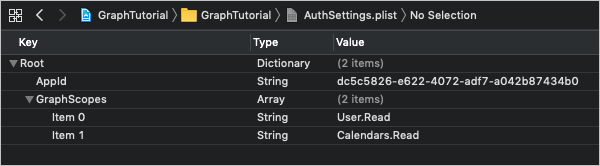
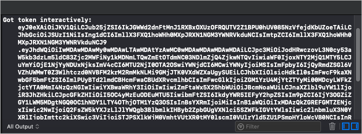

<!-- markdownlint-disable MD002 MD041 -->

In dieser Übung erweitern Sie die Anwendung aus der vorherigen Übung, um die Authentifizierung mit Azure AD zu unterstützen. Dies ist erforderlich, um das erforderliche OAuth-Zugriffstoken zum Aufrufen von Microsoft Graph zu erhalten. Hierzu integrieren Sie die [Microsoft-Authentifizierungsbibliothek (MSAL) für IOS](https://github.com/AzureAD/microsoft-authentication-library-for-objc) in die Anwendung.

1. Erstellen Sie eine neue **Eigenschaftenlisten** Datei im **GraphTutorial** -Projekt mit dem Namen **AuthSettings. plist**.
1. Fügen Sie die folgenden Elemente zur Datei im **Stamm** Wörterbuch hinzu.

    | Key | Typ | Wert |
    |-----|------|-------|
    | `AppId` | Zeichenfolge | Die Anwendungs-ID aus dem Azure-Portal |
    | `GraphScopes` | Array | Zwei Zeichenfolgenwerte `User.Read` : und`Calendars.Read` |

    

> [!IMPORTANT]
> Wenn Sie die Quellcodeverwaltung wie git verwenden, wäre es nun ein guter Zeitpunkt, die Datei **AuthSettings. plist** aus der Quellcodeverwaltung auszuschließen, um unbeabsichtigtes Auslaufen ihrer APP-ID zu vermeiden.

## <a name="implement-sign-in"></a>Implementieren der Anmeldung

In diesem Abschnitt Konfigurieren Sie das Projekt für MSAL, erstellen eine Authentifizierungs-Manager-Klasse und aktualisieren die APP, um sich anzumelden und abzumelden.

### <a name="configure-project-for-msal"></a>Konfigurieren des Projekts für MSAL

1. Fügen Sie der Projektfunktion eine neue Schlüsselbund Gruppe hinzu.
    1. Wählen Sie das **GraphTutorial** -Projekt aus, und **Signieren Sie & Funktionen**.
    1. Wählen Sie **+-Funktion**aus, und doppelklicken Sie dann auf **Schlüsselbund Freigabe**.
    1. Fügen Sie eine Schlüsselbund Gruppe mit `com.microsoft.adalcache`dem Wert hinzu.

1. Steuerelement klicken Sie auf **Info. plist** , und wählen Sie dann **Öffnen als**, dann **Quellcode**aus.
1. Fügen Sie das folgende innerhalb `<dict>` des-Elements hinzu.

    ```xml
    <key>CFBundleURLTypes</key>
    <array>
      <dict>
        <key>CFBundleURLSchemes</key>
        <array>
          <string>msauth.$(PRODUCT_BUNDLE_IDENTIFIER)</string>
        </array>
      </dict>
    </array>
    <key>LSApplicationQueriesSchemes</key>
    <array>
        <string>msauthv2</string>
        <string>msauthv3</string>
    </array>
    ```

1. Öffnen Sie **AppDelegate. Swift** , und fügen Sie die folgende Importanweisung am Anfang der Datei hinzu.

    ```Swift
    import MSAL
    ```

1. Fügen Sie die folgende Funktion zur `AppDelegate`-Klasse hinzu:

    :::code language="swift" source="../demo/GraphTutorial/GraphTutorial/AppDelegate.swift" id="HandleMsalResponseSnippet":::

### <a name="create-authentication-manager"></a>Erstellen des Authentifizierungs-Managers

1. Erstellen Sie eine neue **SWIFT-Datei** im **GraphTutorial** -Projekt mit dem Namen **AuthenticationManager. Swift**. Fügen Sie den folgenden Code in die Datei ein:

    :::code language="swift" source="../demo/GraphTutorial/GraphTutorial/AuthenticationManager.swift" id="AuthManagerSnippet":::

### <a name="add-sign-in-and-sign-out"></a>Hinzufügen von Anmelde-und Abmeldungen

1. Öffnen Sie **SignInViewController. Swift** , und ersetzen Sie den Inhalt durch den folgenden Code.

    :::code language="swift" source="../demo/GraphTutorial/GraphTutorial/SignInViewController.swift" id="SignInViewSnippet":::

1. Öffnen Sie **WelcomeViewController. Swift** , und ersetzen `signOut` Sie die vorhandene Funktion durch Folgendes.

    :::code language="swift" source="../demo/GraphTutorial/GraphTutorial/WelcomeViewController.swift" id="SignOutSnippet":::

1. Speichern Sie Ihre Änderungen, und starten Sie die Anwendung im Simulator neu.

Wenn Sie sich bei der App anmelden, sollten Sie ein Zugriffstoken sehen, das im Ausgabefenster von Xcode angezeigt wird.



## <a name="get-user-details"></a>Benutzerdetails abrufen

In diesem Abschnitt erstellen Sie eine Hilfsklasse, die alle Aufrufe von Microsoft Graph enthält, und aktualisieren Sie `WelcomeViewController` , um die neue Klasse zum Abrufen des angemeldeten Benutzers zu verwenden.

1. Erstellen Sie eine neue **SWIFT-Datei** im **GraphTutorial** -Projekt mit dem Namen **graphmanager. Swift**. Fügen Sie den folgenden Code in die Datei ein:

    ```Swift
    import Foundation
    import MSGraphClientSDK
    import MSGraphClientModels

    class GraphManager {

        // Implement singleton pattern
        static let instance = GraphManager()

        private let client: MSHTTPClient?

        private init() {
            client = MSClientFactory.createHTTPClient(with: AuthenticationManager.instance)
        }

        public func getMe(completion: @escaping(MSGraphUser?, Error?) -> Void) {
            // GET /me
            let meRequest = NSMutableURLRequest(url: URL(string: "\(MSGraphBaseURL)/me")!)
            let meDataTask = MSURLSessionDataTask(request: meRequest, client: self.client, completion: {
                (data: Data?, response: URLResponse?, graphError: Error?) in
                guard let meData = data, graphError == nil else {
                    completion(nil, graphError)
                    return
                }

                do {
                    // Deserialize response as a user
                    let user = try MSGraphUser(data: meData)
                    completion(user, nil)
                } catch {
                    completion(nil, error)
                }
            })

            // Execute the request
            meDataTask?.execute()
        }
    }
    ```

1. Öffnen Sie **WelcomeViewController. Swift** , und fügen `import` Sie die folgende Anweisung am Anfang der Datei hinzu.

    ```Swift
    import MSGraphClientModels
    ```

1. Fügen Sie der `WelcomeViewController`-Klasse die folgende Eigenschaft hinzu.

    ```Swift
    private let spinner = SpinnerViewController()
    ```

1. Ersetzen Sie den `viewDidLoad` vorhandenen durch den folgenden Code.

    :::code language="swift" source="../demo/GraphTutorial/GraphTutorial/WelcomeViewController.swift" id="ViewDidLoadSnippet":::

Wenn Sie Ihre Änderungen speichern und die APP jetzt neu starten, wird die Benutzeroberfläche nach der Anmeldung mit dem Anzeigenamen und der e-Mail-Adresse des Benutzers aktualisiert.
