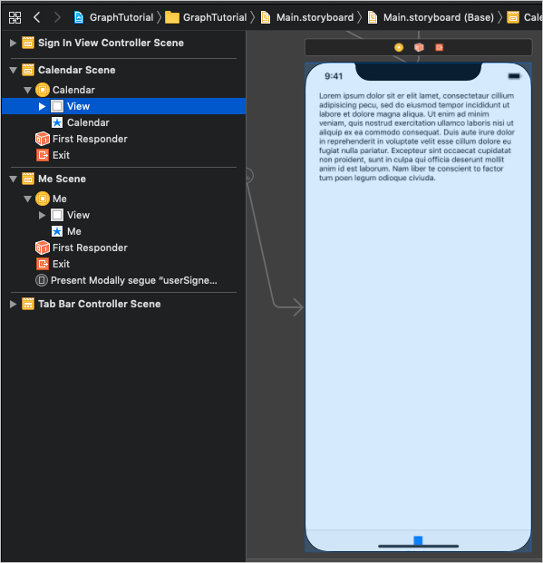
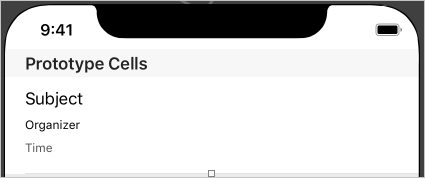
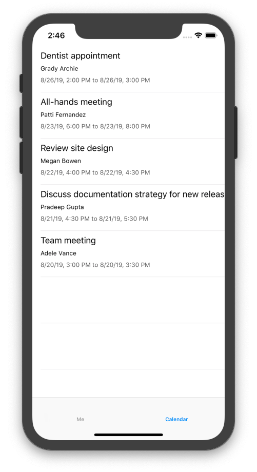

<!-- markdownlint-disable MD002 MD041 -->

<span data-ttu-id="11acc-101">In dieser Übung werden Sie das Microsoft Graph in die Anwendung integrieren.</span><span class="sxs-lookup"><span data-stu-id="11acc-101">In this exercise you will incorporate the Microsoft Graph into the application.</span></span> <span data-ttu-id="11acc-102">Für diese Anwendung verwenden Sie das [Microsoft Graph-SDK für Objective C](https://github.com/microsoftgraph/msgraph-sdk-objc) , um Anrufe an Microsoft Graph zu tätigen.</span><span class="sxs-lookup"><span data-stu-id="11acc-102">For this application, you will use the [Microsoft Graph SDK for Objective C](https://github.com/microsoftgraph/msgraph-sdk-objc) to make calls to Microsoft Graph.</span></span>

## <a name="get-calendar-events-from-outlook"></a><span data-ttu-id="11acc-103">Abrufen von Kalenderereignissen von Outlook</span><span class="sxs-lookup"><span data-stu-id="11acc-103">Get calendar events from Outlook</span></span>

<span data-ttu-id="11acc-104">In diesem Abschnitt erweitern Sie die `GraphManager` Klasse so, dass eine Funktion hinzugefügt wird, um die Ereignisse `CalendarViewController` des Benutzers abzurufen und diese neuen Funktionen zu aktualisieren.</span><span class="sxs-lookup"><span data-stu-id="11acc-104">In this section you will extend the `GraphManager` class to add a function to get the user's events and update `CalendarViewController` to use these new functions.</span></span>

1. <span data-ttu-id="11acc-105">Öffnen Sie **graphmanager. Swift** , und fügen Sie der `GraphManager` Klasse die folgende Methode hinzu.</span><span class="sxs-lookup"><span data-stu-id="11acc-105">Open **GraphManager.swift** and add the following method to the `GraphManager` class.</span></span>

    ```Swift
    public func getEvents(completion: @escaping(Data?, Error?) -> Void) {
        // GET /me/events?$select='subject,organizer,start,end'$orderby=createdDateTime DESC
        // Only return these fields in results
        let select = "$select=subject,organizer,start,end"
        // Sort results by when they were created, newest first
        let orderBy = "$orderby=createdDateTime+DESC"
        let eventsRequest = NSMutableURLRequest(url: URL(string: "\(MSGraphBaseURL)/me/events?\(select)&\(orderBy)")!)
        let eventsDataTask = MSURLSessionDataTask(request: eventsRequest, client: self.client, completion: {
            (data: Data?, response: URLResponse?, graphError: Error?) in
            guard let eventsData = data, graphError == nil else {
                completion(nil, graphError)
                return
            }

            // TEMPORARY
            completion(eventsData, nil)
        })

        // Execute the request
        eventsDataTask?.execute()
    }
    ```

    > [!NOTE]
    > <span data-ttu-id="11acc-106">Überprüfen Sie, was `getEvents` der Code in tut.</span><span class="sxs-lookup"><span data-stu-id="11acc-106">Consider what the code in `getEvents` is doing.</span></span>
    >
    > - <span data-ttu-id="11acc-107">Die URL, die aufgerufen wird, lautet `/v1.0/me/events`.</span><span class="sxs-lookup"><span data-stu-id="11acc-107">The URL that will be called is `/v1.0/me/events`.</span></span>
    > - <span data-ttu-id="11acc-108">Der `select` Abfrageparameter schränkt die für die einzelnen Ereignisse zurückgegebenen Felder auf diejenigen ein, die von der APP tatsächlich verwendet werden.</span><span class="sxs-lookup"><span data-stu-id="11acc-108">The `select` query parameter limits the fields returned for each events to just those the app will actually use.</span></span>
    > - <span data-ttu-id="11acc-109">Der `orderby` Abfrageparameter sortiert die Ergebnisse nach dem Datum und der Uhrzeit, zu der Sie erstellt wurden, wobei das letzte Element zuerst angezeigt wird.</span><span class="sxs-lookup"><span data-stu-id="11acc-109">The `orderby` query parameter sorts the results by the date and time they were created, with the most recent item being first.</span></span>

1. <span data-ttu-id="11acc-110">Öffnen Sie **CalendarViewController. Swift** , und ersetzen Sie den gesamten Inhalt durch den folgenden Code.</span><span class="sxs-lookup"><span data-stu-id="11acc-110">Open **CalendarViewController.swift** and replace its entire contents with the following code.</span></span>

    ```Swift
    import UIKit
    import MSGraphClientModels

    class CalendarViewController: UIViewController {

        @IBOutlet var calendarJSON: UITextView!

        private let spinner = SpinnerViewController()

        override func viewDidLoad() {
            super.viewDidLoad()

            // Do any additional setup after loading the view.
            self.spinner.start(container: self)

            GraphManager.instance.getEvents {
                (data: Data?, error: Error?) in
                DispatchQueue.main.async {
                    self.spinner.stop()

                    guard let eventsData = data, error == nil else {
                        self.calendarJSON.text = error.debugDescription
                        return
                    }

                    let jsonString = String(data: eventsData, encoding: .utf8)
                    self.calendarJSON.text = jsonString
                    self.calendarJSON.sizeToFit()
                }
            }
        }
    }
    ```

<span data-ttu-id="11acc-111">Sie können nun die app ausführen, sich anmelden und auf das Navigationselement **Kalender** im Menü tippen.</span><span class="sxs-lookup"><span data-stu-id="11acc-111">You can now run the app, sign in, and tap the **Calendar** navigation item in the menu.</span></span> <span data-ttu-id="11acc-112">Es sollte ein JSON-Dump der Ereignisse in der App angezeigt werden.</span><span class="sxs-lookup"><span data-stu-id="11acc-112">You should see a JSON dump of the events in the app.</span></span>

## <a name="display-the-results"></a><span data-ttu-id="11acc-113">Anzeigen der Ergebnisse</span><span class="sxs-lookup"><span data-stu-id="11acc-113">Display the results</span></span>

<span data-ttu-id="11acc-114">Nun können Sie das JSON-Dump durch etwas ersetzen, um die Ergebnisse auf eine benutzerfreundliche Weise anzuzeigen.</span><span class="sxs-lookup"><span data-stu-id="11acc-114">Now you can replace the JSON dump with something to display the results in a user-friendly manner.</span></span> <span data-ttu-id="11acc-115">In diesem Abschnitt ändern Sie die `getEvents` Funktion so, dass stark typisierte Objekte zurückgegeben werden, `CalendarViewController` und ändern, um die Ereignisse mithilfe einer Tabellenansicht zu rendern.</span><span class="sxs-lookup"><span data-stu-id="11acc-115">In this section, you will modify the `getEvents` function to return strongly-typed objects, and modify `CalendarViewController` to use a table view to render the events.</span></span>

1. <span data-ttu-id="11acc-116">Öffnen Sie **graphmanager. Swift**.</span><span class="sxs-lookup"><span data-stu-id="11acc-116">Open **GraphManager.swift**.</span></span> <span data-ttu-id="11acc-117">Ersetzen Sie die vorhandene `getEvents`-Funktion durch Folgendes.</span><span class="sxs-lookup"><span data-stu-id="11acc-117">Replace the existing `getEvents` function with the following.</span></span>

    :::code language="swift" source="../demo/GraphTutorial/GraphTutorial/GraphManager.swift" id="GetEventsSnippet" highlight="1,17-38":::

1. <span data-ttu-id="11acc-118">Erstellen Sie eine neue **Cocoa Touch-Klassen** Datei im **GraphTutorial** - `CalendarTableViewCell.swift`Projekt mit dem Namen.</span><span class="sxs-lookup"><span data-stu-id="11acc-118">Create a new **Cocoa Touch Class** file in the **GraphTutorial** project named `CalendarTableViewCell.swift`.</span></span> <span data-ttu-id="11acc-119">Wählen Sie **UITableViewCell** in der unter **Klasse von Field aus** .</span><span class="sxs-lookup"><span data-stu-id="11acc-119">Choose **UITableViewCell** in the **Subclass of** field.</span></span>

1. <span data-ttu-id="11acc-120">Öffnen Sie **CalendarTableViewCell. Swift** , und fügen Sie der `CalendarTableViewCell` -Klasse den folgenden Code hinzu.</span><span class="sxs-lookup"><span data-stu-id="11acc-120">Open **CalendarTableViewCell.swift** and add the following code to the `CalendarTableViewCell` class.</span></span>

    :::code language="swift" source="../demo/GraphTutorial/GraphTutorial/CalendarTableViewCell.swift" id="PropertiesSnippet":::

1. <span data-ttu-id="11acc-121">Öffnen Sie **Main. Storyboard** , und suchen Sie die **Kalender Szene**.</span><span class="sxs-lookup"><span data-stu-id="11acc-121">Open **Main.storyboard** and locate the **Calendar Scene**.</span></span> <span data-ttu-id="11acc-122">Wählen Sie die **Ansicht** in der **Kalender Szene** aus, und löschen Sie Sie.</span><span class="sxs-lookup"><span data-stu-id="11acc-122">Select the **View** in the **Calendar Scene** and delete it.</span></span>

    

1. <span data-ttu-id="11acc-124">Hinzufügen einer **Tabellenansicht** aus der **Bibliothek** zur **Kalender Szene**.</span><span class="sxs-lookup"><span data-stu-id="11acc-124">Add a **Table View** from the **Library** to the **Calendar Scene**.</span></span>
1. <span data-ttu-id="11acc-125">Wählen Sie die Tabellenansicht aus, und wählen Sie dann den **Attributes Inspector**aus.</span><span class="sxs-lookup"><span data-stu-id="11acc-125">Select the table view, then select the **Attributes Inspector**.</span></span> <span data-ttu-id="11acc-126">Legen Sie **Prototype Cells** auf **1**fest.</span><span class="sxs-lookup"><span data-stu-id="11acc-126">Set **Prototype Cells** to **1**.</span></span>
1. <span data-ttu-id="11acc-127">Verwenden Sie die **Bibliothek** , um der Zelle Prototyp drei **Beschriftungen** hinzuzufügen.</span><span class="sxs-lookup"><span data-stu-id="11acc-127">Use the **Library** to add three **Labels** to the prototype cell.</span></span>
1. <span data-ttu-id="11acc-128">Wählen Sie die Zelle Prototyp aus, und wählen Sie dann den **Identitäts Inspektor**aus.</span><span class="sxs-lookup"><span data-stu-id="11acc-128">Select the prototype cell, then select the **Identity Inspector**.</span></span> <span data-ttu-id="11acc-129">Ändern Sie die **Klasse** in **CalendarTableViewCell**.</span><span class="sxs-lookup"><span data-stu-id="11acc-129">Change **Class** to **CalendarTableViewCell**.</span></span>
1. <span data-ttu-id="11acc-130">Wählen Sie den **Attributes Inspector** aus, `EventCell`und legen Sie **Identifier** auf fest.</span><span class="sxs-lookup"><span data-stu-id="11acc-130">Select the **Attributes Inspector** and set **Identifier** to `EventCell`.</span></span>
1. <span data-ttu-id="11acc-131">Wählen Sie mit ausgewähltem **EventCell** den **Verbindungs Inspektor** aus, `durationLabel`und `organizerLabel`verbinden `subjectLabel` Sie die Beschriftungen, die Sie der Zelle im Storyboard hinzugefügt haben.</span><span class="sxs-lookup"><span data-stu-id="11acc-131">With the **EventCell** selected, select the **Connections Inspector** and connect `durationLabel`, `organizerLabel`, and `subjectLabel` to the labels you added to the cell on the storyboard.</span></span>
1. <span data-ttu-id="11acc-132">Legen Sie die Eigenschaften und Einschränkungen für die drei Beschriftungen wie folgt fest.</span><span class="sxs-lookup"><span data-stu-id="11acc-132">Set the properties and constraints on the three labels as follows.</span></span>

    - <span data-ttu-id="11acc-133">**Betreff-Bezeichnung**</span><span class="sxs-lookup"><span data-stu-id="11acc-133">**Subject Label**</span></span>
        - <span data-ttu-id="11acc-134">Add Constraint: Leading Space to Content View Leading Margin, Value: 0</span><span class="sxs-lookup"><span data-stu-id="11acc-134">Add constraint: Leading space to Content View Leading Margin, value: 0</span></span>
        - <span data-ttu-id="11acc-135">Add Constraint: nachgestellter Raum zur Inhaltsansicht nach folgender Rand, Wert: 0</span><span class="sxs-lookup"><span data-stu-id="11acc-135">Add constraint: Trailing space to Content View Trailing Margin, value: 0</span></span>
        - <span data-ttu-id="11acc-136">Hinzufügen von Einschränkungen: oberer Bereich für oberer Rand der Inhaltsansicht, Wert: 0</span><span class="sxs-lookup"><span data-stu-id="11acc-136">Add constraint: Top space to Content View Top Margin, value: 0</span></span>
    - <span data-ttu-id="11acc-137">**Organizer-Bezeichnung**</span><span class="sxs-lookup"><span data-stu-id="11acc-137">**Organizer Label**</span></span>
        - <span data-ttu-id="11acc-138">Schriftart: System 12,0</span><span class="sxs-lookup"><span data-stu-id="11acc-138">Font: System 12.0</span></span>
        - <span data-ttu-id="11acc-139">Add Constraint: Leading Space to Content View Leading Margin, Value: 0</span><span class="sxs-lookup"><span data-stu-id="11acc-139">Add constraint: Leading space to Content View Leading Margin, value: 0</span></span>
        - <span data-ttu-id="11acc-140">Add Constraint: nachgestellter Raum zur Inhaltsansicht nach folgender Rand, Wert: 0</span><span class="sxs-lookup"><span data-stu-id="11acc-140">Add constraint: Trailing space to Content View Trailing Margin, value: 0</span></span>
        - <span data-ttu-id="11acc-141">Add Constraint: Top Space to subject Label Bottom, Value: Standard</span><span class="sxs-lookup"><span data-stu-id="11acc-141">Add constraint: Top space to Subject Label Bottom, value: Standard</span></span>
    - <span data-ttu-id="11acc-142">**Dauer Bezeichnung**</span><span class="sxs-lookup"><span data-stu-id="11acc-142">**Duration Label**</span></span>
        - <span data-ttu-id="11acc-143">Schriftart: System 12,0</span><span class="sxs-lookup"><span data-stu-id="11acc-143">Font: System 12.0</span></span>
        - <span data-ttu-id="11acc-144">Farbe: dunkle graue Farbe</span><span class="sxs-lookup"><span data-stu-id="11acc-144">Color: Dark Gray Color</span></span>
        - <span data-ttu-id="11acc-145">Add Constraint: Leading Space to Content View Leading Margin, Value: 0</span><span class="sxs-lookup"><span data-stu-id="11acc-145">Add constraint: Leading space to Content View Leading Margin, value: 0</span></span>
        - <span data-ttu-id="11acc-146">Add Constraint: nachgestellter Raum zur Inhaltsansicht nach folgender Rand, Wert: 0</span><span class="sxs-lookup"><span data-stu-id="11acc-146">Add constraint: Trailing space to Content View Trailing Margin, value: 0</span></span>
        - <span data-ttu-id="11acc-147">Add Constraint: Top Space to Organizer Label Bottom, Value: Standard</span><span class="sxs-lookup"><span data-stu-id="11acc-147">Add constraint: Top space to Organizer Label Bottom, value: Standard</span></span>
        - <span data-ttu-id="11acc-148">Add Constraint: Bottom Space to Content View Bottom Margin, Value: 8</span><span class="sxs-lookup"><span data-stu-id="11acc-148">Add constraint: Bottom space to Content View Bottom Margin, value: 8</span></span>

    

1. <span data-ttu-id="11acc-150">Öffnen Sie **CalendarViewController. Swift** , und ersetzen Sie den Inhalt durch den folgenden Code.</span><span class="sxs-lookup"><span data-stu-id="11acc-150">Open **CalendarViewController.swift** and replace its contents with the following code.</span></span>

    :::code language="swift" source="../demo/GraphTutorial/GraphTutorial/CalendarViewController.swift" id="CalendarViewSnippet":::

1. <span data-ttu-id="11acc-151">Führen Sie die APP aus, melden Sie sich an, und tippen Sie auf die Registerkarte **Kalender** . Die Liste der Ereignisse sollte angezeigt werden.</span><span class="sxs-lookup"><span data-stu-id="11acc-151">Run the app, sign in, and tap the **Calendar** tab. You should see the list of events.</span></span>

    
